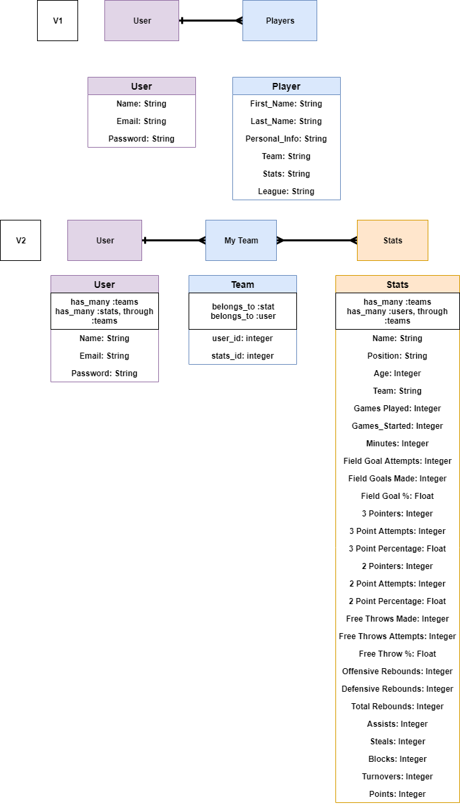
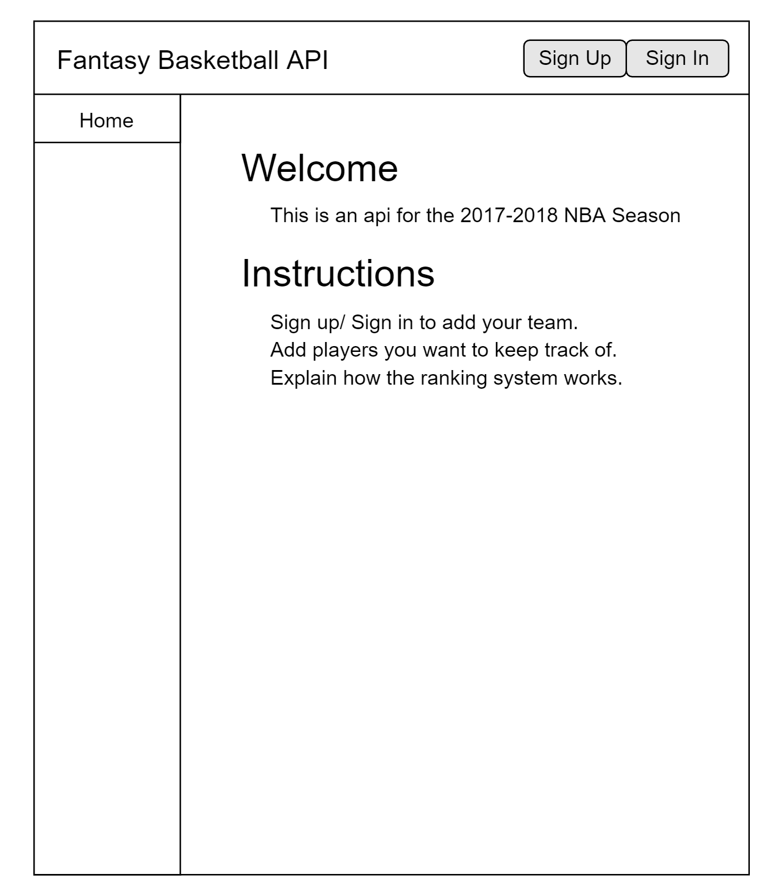
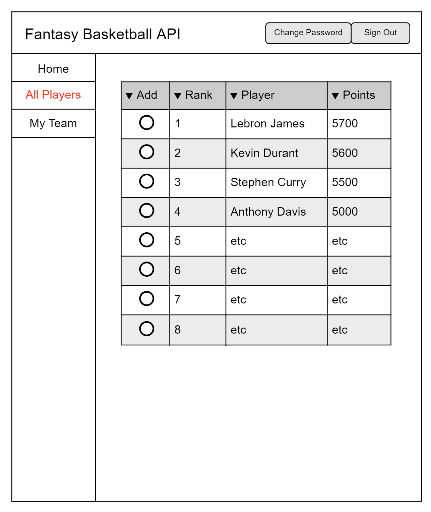
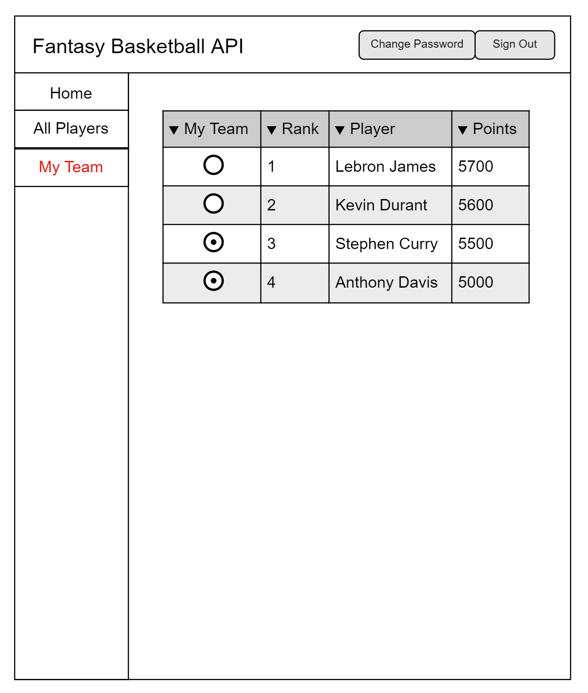

# Fantasy Basketball Full Stack Project- Project Two by Joe Woo WDI Cohort 28

## 2017/2018 NBA Stats API
The goal of this project was to set up an database for the 2017-2018 NBA season, and to provide a useful tool for fantasy players. This app is useful so that you can reflect your previous choices in previous years, and re-evaluate which players you would choose in which rounds.

## Installation Guide
### Front End Installation(Current Repo)
1. Fork and clone this repository.
2. Install dependencies with `npm install`.
3. Run the development server with `grunt serve`.

### Back End Installation (https://github.com/jooewoo/full-stack-back-end-client)
1. Fork and clone this repository.
2. Install dependencies with `bundle install.`
3. Create a .env for sensitive settings (`touch .env`).
4. Generate new development and test secrets (`bundle exec rails secret`).
5. Store them in .env with keys `SECRET_KEY_BASE_<DEVELOPMENT|TEST>` respectively.
6. Set up a Heroku server
7. Set up your database with the following:
  - `bin/rails db:reset`
    or you can
  - `bin/rails db:drop` (if it already exists)
  - `bin/rails db:create`
  - `bin/rails db:migrate`
  - `bin/rails db:seed` (seeds the stats csv in db/seeds.rb)
8. Run the API server with `bin/rails server` or `bundle exec rails server.`

## Development Process/Problem Solving Strategy
Before I began even coding, I decided to make my ERD diagrams, user stories, what my database needs, and the logical steps to build my application. For my ERD, I designed a version 1 draft which included a user and a stats resource. Once I finished resources, I worked on my user stories to determine
  1. What CRUD actions do I need for the user to use
  2. What information would the user get back with the CRUD actions.
  3. What is the best way to display this information.

After the user stories, I decided to make a basic wireframe. Finally, I made a to do list to try and accomplish all the MVP by the four day deadline.

### ERD

### User Stories
* A user wants to create an account.
* A user wants to sign in/ log out.
* A user wants to update their password.
* A user wants to have a clean design.
* A user wants to be able to see all the top player's stats.
* A user wants to be able to import their team.
* A user wants to filter out players that are already been selected.
* A user wants to see how many points each player accumulates in one week.
* A user wants to see projections for the next season.
* A user wants to be able to find a player by searching in a search bar.
* A user wants to see more information about the player.

## Wireframes
Sign Up/ Sign In

All Players

My Team

## API
### Authentication

| Verb   | URI Pattern            | Controller#Action |
|--------|------------------------|-------------------|
| POST   | `/sign-up`             | `users#signup`    |
| POST   | `/sign-in`             | `users#signin`    |
| PATCH  | `/change-password/`    | `users#changepw`  |
| DELETE | `/sign-out/`           | `users#signout`   |
| GET    | `/users/:id`           | `users#show`      |

### Teams

| Verb   | URI Pattern              | Controller#Action   |
|--------|--------------------------|---------------------|
| POST   | `/teams`                 | `teams#create`      |
| GET    | `/teams`                 | `teams#index`       |
| DELETE | `/teams/:id`             | `teams#destroy`     |

### Stats

| Verb   |     URI Pattern         |     Controller#Action      |
|--------|-------------------------|----------------------------|
| POST   |     `/stats`            |      `stats#create`        |
| GET    |     `/stats`            |      `stats#index`         |
| GET    |     `/stats/:id`        |      `stats#show`          |
| PATCH  |     `/stats/:id`        |      `stats#update`        |
| DELETE |     `/stats/:id`        |      `stats#destroy`       |

### Wireframes

## Future Intentions
1. I want to make an API that updates daily for the current season
2. Add up to date NFL season, and previous NFL seasons
3. Style and organize in an efficient manner.
4. Want to style it for mobile as well.

## Links
* [Front-end repo](https://github.com/jooewoo/full-stack-front-end-client)
* [Back-end repo](https://github.com/jooewoo/full-stack-back-end-client)
* [Front-end deployed](https://jooewoo.github.io/full-stack-front-end-client/)
* [Heroku deployment](https://guarded-taiga-82563.herokuapp.com/)

## Technologies Used
* HTML
* CSS
* JavaScript
* SASS
* Boostrap
* Handlebars
* AJAX
* Jquery
* Ruby
* Ruby on Rails

## Author
Joseph Woo
## Acknowledgments
I want to thank [Basketball Reference](https://www.basketball-reference.com/) for providing a nice csv file that I could seed my data with.
